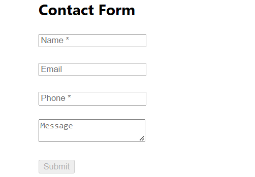
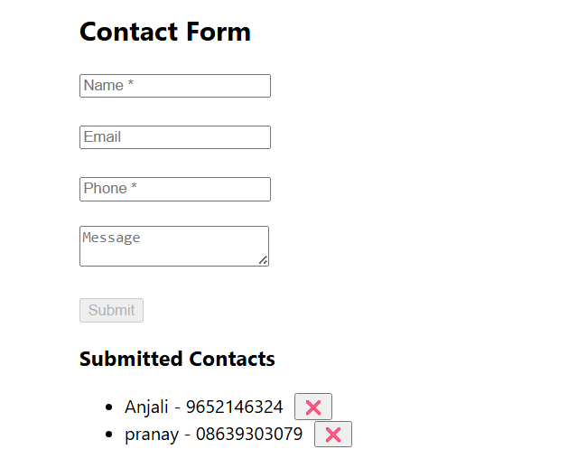
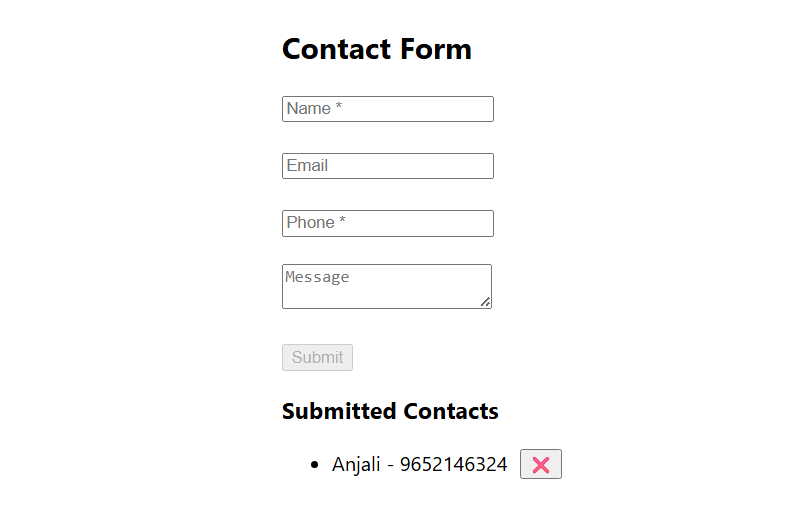

# Contact Management Web App (MERN Stack)

A simple Contact Management web application built using the MERN stack.  
This project demonstrates core MERN fundamentals including frontend form handling, backend APIs, database integration, and dynamic UI updates.

---

## 🚀 Features

- Add new contacts with validation
- View all submitted contacts without page reload
- Delete contacts instantly
- Client-side form validation
- Success feedback messages
- Contacts sorted alphabetically
- Clean and responsive UI

---

## Folder Structure

contact-app/
 ├── backend/
 │    ├── server.js
 │    ├── models/Contact.js
 │    └── routes/contactRoutes.js
 └── frontend/
      └── (React app)


## 🛠️ Tech Stack

### Frontend
- React.js
- JavaScript
- HTML, CSS
- React Hooks (useState, useEffect)

### Backend
- Node.js
- Express.js

### Database
- MongoDB

---

## 📋 Contact Form Fields

- **Name** (Required)
- **Email** (Optional, valid format)
- **Phone** (Required)
- **Message** (Optional)

Submit button remains disabled until required fields are filled.

---

## 🔗 API Endpoints

| Method | Endpoint | Description |
|------|---------|-------------|
| POST | `/api/contacts` | Add a new contact |
| GET | `/api/contacts` | Fetch all contacts |
| DELETE | `/api/contacts/:id` | Delete a contact |

---

## ⚙️ Local Setup Instructions

### 1️⃣ Clone the repository
```bash
git clone https://github.com/AnkithaVanam21/contact-manager.git
```

2️⃣ Backend Setup
cd contact-manager/backend
npm install
node server.js

Backend runs on:

http://localhost:5000

3️⃣ Frontend Setup
cd ../frontend
npm install
npm start


Frontend runs on:
http://localhost:3000


🧠 Architecture Overview
React UI
   |
   |  HTTP Requests (Fetch API)
   v
Node.js + Express API
   |
   v
MongoDB Database

🎯 Evaluation Focus

1. MERN stack understanding
2. REST API structure
3. MongoDB schema usage
4. Clean and readable code
5. Functional UI with good UX

🌟 Bonus Enhancements

1. Delete contact functionality
2.  Success message feedback
3. Client-side sorting
4. Colorful and clean UI design

## 📸 Screenshots

### Contact Form


### Submitted Contacts



### Delete Contact




👩‍💻 Author
Ankitha Vanam
B.Tech CSE (AI & ML)
Aspiring Full Stack / MERN Developer